# RAG System Migration Design Document
## ChromaDB to Upstash Vector Database

### Document Information
- **Project**: RAG Food Information System
- **Version**: 1.0
- **Date**: October 9, 2025
- **Author**: AI Development Team
- **Status**: Draft

### Executive Summary
This document outlines the migration strategy from ChromaDB to Upstash Vector Database for the RAG (Retrieval-Augmented Generation) food information system. The migration aims to improve scalability, reduce infrastructure complexity, and leverage cloud-native embedding capabilities.

### Table of Contents
1. [Project Overview](#project-overview)
2. [Current State Analysis](#current-state-analysis)
3. [Target State Architecture](#target-state-architecture)
4. [Requirements Analysis](#requirements-analysis)
5. [Implementation Plan](#implementation-plan)
6. [Risk Assessment](#risk-assessment)
7. [Success Metrics](#success-metrics)
8. [Timeline and Milestones](#timeline-and-milestones)

## 1. Project Overview

### 1.1 Business Objectives
- Migrate from local ChromaDB to cloud-native Upstash Vector
- Eliminate manual embedding generation overhead
- Improve system scalability and reliability
- Reduce infrastructure maintenance costs
- Maintain or improve query performance

### 1.2 Scope
- **In Scope**: Vector database migration, embedding pipeline changes, query optimization
- **Out of Scope**: UI changes, LLM model changes, food data structure modifications

## 2. Current State Analysis

### 2.1 Current State Architecture

```mermaid
flowchart TD
    subgraph "👤 User Interface"
        A["User Query<br/>❓ Food-related questions"]
    end
    
    subgraph "🧠 RAG Processing Layer"
        B["RAG System<br/>📄 rag_run.py"]
        C["Query Processing<br/>🔄 Text normalization"]
    end
    
    subgraph "🌐 Local Embedding Service"
        D["Ollama API<br/>🔗 localhost:11434"]
        E["Embedding Model<br/>📊 mxbai-embed-large<br/>4096 dimensions"]
    end
    
    subgraph "💾 Local Vector Storage"
        F["ChromaDB Client<br/>🗃️ Persistent storage"]
        G["Local Database<br/>📁 chroma_db/"]
    end
    
    subgraph "🤖 Local Language Model"
        H["Ollama LLM<br/>🦙 Llama 3.2"]
        I["Response Generation<br/>💬 Context-aware answers"]
    end
    
    subgraph "📊 Data Source"
        J["Food Data<br/>📋 foods.json"]
    end
    
    A --> B
    B --> C
    C --> D
    D --> E
    E --> F
    F --> G
    J --> F
    F --> H
    H --> I
    I --> A
    
    classDef userClass fill:#e3f2fd,stroke:#1976d2,stroke-width:3px
    classDef processClass fill:#f3e5f5,stroke:#7b1fa2,stroke-width:2px
    classDef embeddingClass fill:#fff3e0,stroke:#f57c00,stroke-width:2px
    classDef storageClass fill:#e8f5e8,stroke:#388e3c,stroke-width:2px
    classDef llmClass fill:#fce4ec,stroke:#c2185b,stroke-width:2px
    classDef dataClass fill:#fff8e1,stroke:#fbc02d,stroke-width:2px
    
    class A userClass
    class B,C processClass
    class D,E embeddingClass
    class F,G storageClass
    class H,I llmClass
    class J dataClass
```

### 2.2 Current Technology Stack
- **Vector Database**: ChromaDB (local persistent client)
- **Embedding Model**: Ollama mxbai-embed-large (4096 dimensions)
- **LLM**: Ollama Llama 3.2
- **Data Storage**: Local JSON file + ChromaDB
- **Infrastructure**: Local development environment

### 2.3 Current Pain Points
1. **Performance Bottlenecks**
   - Manual embedding generation for each query
   - Local compute resource constraints
   - Cold start latency for Ollama embedding service

2. **Operational Challenges**
   - Manual ChromaDB maintenance
   - Local storage scaling limitations
   - No built-in backup/recovery
   - Development environment dependencies

3. **Scalability Issues**
   - Single-node architecture
   - No horizontal scaling capability
   - Resource contention between embedding and LLM services

## 3. Target State Architecture

### 3.1 Architecture Comparison Overview

```mermaid
flowchart LR
    subgraph "📍 CURRENT: Local ChromaDB"
        direction TB
        A1["👤 User Query"] 
        A2["🧠 RAG System"]
        A3["🌐 Ollama Embedding<br/>⚡ Manual Generation"]
        A4["💾 ChromaDB<br/>🏠 Local Storage"]
        A5["🤖 Ollama LLM"]
        A6["📤 Response"]
        
        A1 --> A2
        A2 --> A3
        A3 --> A4
        A4 --> A2
        A2 --> A5
        A5 --> A6
    end
    
    subgraph "🎯 TARGET: Upstash Vector"
        direction TB
        B1["👤 User Query"]
        B2["🧠 Enhanced RAG"]
        B3["☁️ Upstash Vector<br/>🤖 Auto Embedding"]
        B4["🔍 Cloud Search<br/>📊 Built-in Analytics"]
        B5["🤖 Ollama LLM"]
        B6["📤 Response"]
        
        B1 --> B2
        B2 --> B3
        B3 --> B4
        B4 --> B2
        B2 --> B5
        B5 --> B6
    end
    
    A1 -.->|"🚀 MIGRATION"| B1
    
    classDef currentClass fill:#ffebee,stroke:#d32f2f,stroke-width:2px
    classDef targetClass fill:#e8f5e8,stroke:#2e7d32,stroke-width:2px
    classDef migrationClass fill:#fff3e0,stroke:#f57c00,stroke-width:3px,stroke-dasharray: 5 5
    
    class A1,A2,A3,A4,A5,A6 currentClass
    class B1,B2,B3,B4,B5,B6 targetClass
```

### 3.2 Target State Architecture


### 3.3 Detailed Process Flow

```mermaid
sequenceDiagram
    participant U as 👤 User
    participant R as 🧠 RAG System
    participant UV as ☁️ Upstash Vector
    participant E as 🤖 Embedding Service
    participant VS as 💾 Vector Storage
    participant L as 🦙 Ollama LLM
    
    Note over U,L: 📊 Data Ingestion Phase
    R->>UV: 📤 Upsert food data (raw text)
    UV->>E: 🔄 Auto-generate embeddings
    E->>VS: 💾 Store vectors + metadata
    VS-->>R: ✅ Ingestion complete
    
    Note over U,L: 🔍 Query Processing Phase
    U->>R: ❓ "What foods are good for breakfast?"
    R->>UV: 🔍 Query with raw text
    UV->>E: 🤖 Generate query embedding
    E->>VS: 🔍 Similarity search
    VS->>UV: 📊 Top 3 matches + metadata
    UV-->>R: 📝 Retrieved contexts
    
    Note over U,L: 💬 Response Generation Phase
    R->>R: 🔧 Assemble context
    R->>L: 💭 Generate response with context
    L-->>R: 💬 Generated answer
    R-->>U: 📤 Final response
    
    Note over U,L: ⚡ Key Benefits: No manual embedding, Cloud scaling, Built-in optimization
```

### 3.2 Target Technology Stack
- **Vector Database**: Upstash Vector (cloud-hosted)
- **Embedding Model**: mixedbread-ai/mxbai-embed-large-v1 (1024 dimensions)
- **LLM**: Ollama Llama 3.2 (unchanged)
- **Data Storage**: Cloud vector storage + local JSON
- **Infrastructure**: Hybrid (local LLM + cloud vector DB)

### 3.3 Key Improvements
1. **Performance Enhancements**
   - Automatic embedding generation
   - Cloud-optimized similarity search
   - Reduced local compute requirements
   - Parallel processing capabilities

2. **Operational Benefits**
   - Managed service (no maintenance)
   - Automatic scaling
   - Built-in backup and recovery
   - High availability

3. **Cost Optimization**
   - Pay-per-use pricing model
   - Reduced local infrastructure costs
   - No embedding compute overhead

## 4. Requirements Analysis

### 4.1 Functional Requirements

#### FR-001: Vector Database Migration
- **Requirement**: Replace ChromaDB with Upstash Vector
- **Priority**: High
- **Acceptance Criteria**: 
  - All food data successfully migrated
  - Query functionality maintained
  - Performance metrics meet or exceed baseline

#### FR-002: Automatic Embedding Generation
- **Requirement**: Eliminate manual embedding computation
- **Priority**: High
- **Acceptance Criteria**:
  - Raw text upsert capability
  - No Ollama embedding dependency for data ingestion
  - Embedding consistency validation

#### FR-003: Metadata Support
- **Requirement**: Preserve food region and type information
- **Priority**: Medium
- **Acceptance Criteria**:
  - Metadata filtering capability
  - Enhanced search relevance
  - Backward compatibility

#### FR-004: Query Performance
- **Requirement**: Maintain sub-second query response times
- **Priority**: High
- **Acceptance Criteria**:
  - Average query time ≤ 500ms
  - 99th percentile ≤ 2000ms
  - Error rate < 0.1%

### 4.2 Non-Functional Requirements

#### NFR-001: Availability
- **Requirement**: 99.9% uptime for vector operations
- **Implementation**: Leverage Upstash SLA

#### NFR-002: Security
- **Requirement**: Secure API key management
- **Implementation**: Environment variables, token rotation

#### NFR-003: Scalability
- **Requirement**: Support for 10x data growth
- **Implementation**: Cloud-native auto-scaling

#### NFR-004: Maintainability
- **Requirement**: Simplified operational overhead
- **Implementation**: Managed service adoption

## 5. Implementation Plan

### 5.1 Implementation Flow Overview

```mermaid
flowchart TD
    Start([🚀 Start Migration]) --> P1{Phase 1: Setup}
    
    P1 --> T1[📦 Install Dependencies<br/>upstash-vector, python-dotenv]
    T1 --> T2[🔐 Validate Configuration<br/>Check .env credentials]
    T2 --> T3[🌐 Test API Connectivity<br/>Verify Upstash access]
    T3 --> T4[🔀 Create Dev Branch<br/>feature/upstash-migration]
    T4 --> D1[✅ Phase 1 Complete<br/>Environment Ready]
    
    D1 --> P2{Phase 2: Development}
    
    P2 --> T5[🔄 Client Initialization<br/>Replace ChromaDB imports]
    T5 --> T6[📤 Data Ingestion Rewrite<br/>Remove manual embedding]
    T6 --> T7[🔍 Query System Refactor<br/>Upstash API integration]
    T7 --> T8[⚠️ Error Handling<br/>Add comprehensive checks]
    T8 --> T9[🧪 Unit Testing<br/>Validate functionality]
    T9 --> D2[✅ Phase 2 Complete<br/>Core Implementation Done]
    
    D2 --> P3{Phase 3: Migration}
    
    P3 --> T10[📤 ChromaDB Export<br/>Extract existing data]
    T10 --> T11[📊 Data Validation<br/>Verify integrity]
    T11 --> T12[☁️ Upstash Import<br/>Batch upload to cloud]
    T12 --> T13[🔍 Verify Embeddings<br/>Check auto-generation]
    T13 --> T14[⚖️ Cross-Validation<br/>Compare results]
    T14 --> T15[📈 Performance Test<br/>Benchmark accuracy]
    T15 --> D3[✅ Phase 3 Complete<br/>Migration Successful]
    
    D3 --> P4{Phase 4: Deployment}
    
    P4 --> T16[🚀 Production Deploy<br/>Go-live preparation]
    T16 --> T17[📊 Monitoring Setup<br/>Performance tracking]
    T17 --> T18[👥 User Testing<br/>Acceptance validation]
    T18 --> T19[📚 Documentation<br/>Update guides]
    T19 --> End([🎉 Migration Complete])
    
    classDef phaseClass fill:#e3f2fd,stroke:#1976d2,stroke-width:3px
    classDef taskClass fill:#f3e5f5,stroke:#7b1fa2,stroke-width:2px
    classDef deliverableClass fill:#e8f5e8,stroke:#388e3c,stroke-width:2px
    classDef startEndClass fill:#fff3e0,stroke:#f57c00,stroke-width:3px
    
    class P1,P2,P3,P4 phaseClass
    class T1,T2,T3,T4,T5,T6,T7,T8,T9,T10,T11,T12,T13,T14,T15,T16,T17,T18,T19 taskClass
    class D1,D2,D3 deliverableClass
    class Start,End startEndClass
```

### 5.2 Detailed Phase Breakdown

#### Phase 1: Environment Setup (Day 1)
```mermaid
flowchart LR
    subgraph "🛠️ Environment Setup"
        A[📦 Dependencies] --> B[🔐 Configuration]
        B --> C[🌐 API Test]
        C --> D[🔀 Git Branch]
    end
    
    A --> A1[pip install upstash-vector<br/>pip install python-dotenv]
    B --> B1[Verify UPSTASH_VECTOR_REST_URL<br/>Verify UPSTASH_VECTOR_REST_TOKEN]
    C --> C1[Test connection to Upstash<br/>Validate index access]
    D --> D1[git checkout -b feature/upstash-migration]
```

#### Phase 2: Core Implementation (Days 2-3)
```mermaid
flowchart LR
    subgraph "💻 Core Development"
        A[🔄 Client Setup] --> B[📤 Data Pipeline]
        B --> C[🔍 Query System]
        C --> D[⚠️ Error Handling]
        D --> E[🧪 Testing]
    end
    
    A --> A1[Replace chromadb imports<br/>Initialize Upstash client]
    B --> B1[Remove manual embeddings<br/>Implement batch upsert]
    C --> C1[Update query methods<br/>Add result formatting]
    D --> D1[Connection errors<br/>Rate limiting<br/>Authentication]
    E --> E1[Unit tests<br/>Integration tests]
```

#### Phase 3: Data Migration (Day 4)


## 6. Technical Specifications

### 6.1 Code Architecture Changes

#### New Dependencies
```python
from upstash_vector import Index
from dotenv import load_dotenv
import os
import json
import requests
from typing import List, Dict, Any, Optional
```

#### Environment Configuration
```python
load_dotenv()

# Upstash Configuration
UPSTASH_URL = os.getenv("UPSTASH_VECTOR_REST_URL")
UPSTASH_TOKEN = os.getenv("UPSTASH_VECTOR_REST_TOKEN")
UPSTASH_READONLY_TOKEN = os.getenv("UPSTASH_VECTOR_REST_READONLY_TOKEN")

# Application Configuration
JSON_FILE = os.getenv("JSON_FILE", "foods.json")
MAX_RESULTS = int(os.getenv("MAX_RESULTS", "3"))
LLM_MODEL = os.getenv("LLM_MODEL", "llama3.2")
OLLAMA_HOST = os.getenv("OLLAMA_HOST", "http://localhost:11434")
```

#### Client Initialization with Error Handling
```python
def initialize_upstash_client() -> Index:
    """Initialize Upstash Vector client with proper error handling."""
    try:
        if not UPSTASH_URL or not UPSTASH_TOKEN:
            raise ValueError("Missing Upstash credentials in environment variables")
        
        index = Index(
            url=UPSTASH_URL,
            token=UPSTASH_TOKEN
        )
        
        # Test connectivity
        index.info()
        return index
    
    except Exception as e:
        raise ConnectionError(f"Failed to initialize Upstash client: {e}")
```

### 6.2 Data Ingestion Implementation

#### Batch Upsert Function
```python
def upsert_food_data(index: Index, food_data: List[Dict[str, Any]]) -> None:
    """Upsert food data with metadata to Upstash Vector."""
    try:
        # Prepare data for batch upsert
        vectors = []
        for item in food_data:
            # Create enriched text for better embeddings
            enriched_text = item["text"]
            if "region" in item:
                enriched_text += f" This food is popular in {item['region']}."
            if "type" in item:
                enriched_text += f" It is a type of {item['type']}."
            
            vectors.append((
                item["id"],
                enriched_text,
                {
                    "region": item.get("region", "unknown"),
                    "type": item.get("type", "general"),
                    "original_text": item["text"]
                }
            ))
        
        # Batch upsert (process in chunks for large datasets)
        batch_size = 100
        for i in range(0, len(vectors), batch_size):
            batch = vectors[i:i + batch_size]
            index.upsert(vectors=batch)
            print(f"✅ Upserted batch {i//batch_size + 1}/{(len(vectors)-1)//batch_size + 1}")
            
    except Exception as e:
        raise RuntimeError(f"Failed to upsert data: {e}")
```

### 6.3 Query Implementation

#### Enhanced Query Function
```python
def enhanced_rag_query(index: Index, question: str) -> str:
    """Perform RAG query using Upstash Vector with enhanced error handling."""
    try:
        # Query vector database
        results = index.query(
            data=question,
            top_k=MAX_RESULTS,
            include_metadata=True,
            include_vectors=False  # Don't need vectors in response
        )
        
        if not results or len(results) == 0:
            return "No relevant information found for your question."
        
        # Extract documents and metadata
        contexts = []
        for result in results:
            metadata = result.get('metadata', {})
            original_text = metadata.get('original_text', result.get('data', ''))
            region = metadata.get('region', 'unknown')
            food_type = metadata.get('type', 'general')
            
            contexts.append({
                'text': original_text,
                'region': region,
                'type': food_type,
                'score': result.get('score', 0)
            })
        
        # Display retrieval information
        print("\n🧠 Retrieved relevant information:")
        for i, ctx in enumerate(contexts, 1):
            print(f"🔹 Source {i} (Region: {ctx['region']}, Type: {ctx['type']}, Score: {ctx['score']:.3f}):")
            print(f"    \"{ctx['text']}\"\n")
        
        # Generate response using LLM
        context_text = "\n".join([ctx['text'] for ctx in contexts])
        return generate_llm_response(question, context_text)
        
    except Exception as e:
        print(f"❌ Error during RAG query: {e}")
        return "Sorry, I encountered an error while processing your question."
```

## 7. Risk Assessment

### 7.1 Risk Assessment Flow

```mermaid
flowchart TD
    subgraph "🔴 HIGH IMPACT RISKS"
        R1[⚡ API Rate Limiting<br/>📊 Medium Probability]
        R2[🌐 Network Issues<br/>📊 Low Probability]
        R3[📦 Migration Errors<br/>📊 Medium Probability]
        R4[⏰ Service Downtime<br/>📊 Low Probability]
        R5[🔐 API Key Exposure<br/>📊 Medium Probability]
        R6[🛡️ Data Breach<br/>📊 Low Probability]
    end
    
    subgraph "🟡 MEDIUM IMPACT RISKS"
        R7[🔄 Model Changes<br/>📊 Low Probability]
        R8[📈 Performance Drop<br/>📊 Medium Probability]
        R9[💰 Cost Overruns<br/>📊 Medium Probability]
        R10[🔒 Unauthorized Access<br/>📊 Low Probability]
    end
    
    subgraph "🟢 LOW IMPACT RISKS"
        R11[🏢 Vendor Lock-in<br/>📊 High Probability]
    end
    
    R1 --> M1[🛡️ Exponential Backoff<br/>📦 Request Batching]
    R2 --> M2[🔄 Retry Logic<br/>⚙️ Fallback Mechanisms]
    R3 --> M3[✅ Validation Checks<br/>🔄 Rollback Procedures]
    R4 --> M4[🌍 Multi-region Setup<br/>📊 SLA Monitoring]
    R5 --> M5[🔐 Environment Variables<br/>🔄 Key Rotation]
    R6 --> M6[🔒 Encryption<br/>🛡️ Access Controls]
    
    R7 --> M7[📌 Version Pinning<br/>🧪 Compatibility Tests]
    R8 --> M8[🧪 Load Testing<br/>📊 Performance Monitoring]
    R9 --> M9[📊 Usage Monitoring<br/>🚨 Cost Alerts]
    R10 --> M10[🔍 Token Validation<br/>🌐 IP Whitelisting]
    
    R11 --> M11[🏗️ Abstraction Layer<br/>📚 Exit Strategy Docs]
    
    classDef highRisk fill:#ffebee,stroke:#d32f2f,stroke-width:2px
    classDef mediumRisk fill:#fff3e0,stroke:#f57c00,stroke-width:2px
    classDef lowRisk fill:#e8f5e8,stroke:#388e3c,stroke-width:2px
    classDef mitigation fill:#e3f2fd,stroke:#1976d2,stroke-width:2px
    
    class R1,R2,R3,R4,R5,R6 highRisk
    class R7,R8,R9,R10 mediumRisk
    class R11 lowRisk
    class M1,M2,M3,M4,M5,M6,M7,M8,M9,M10,M11 mitigation
```

### 7.2 Risk Mitigation Priority Matrix


## 8. Success Metrics

### 8.1 Success Metrics Dashboard

```mermaid
flowchart TD
    subgraph "📊 PERFORMANCE METRICS"
        P1[⚡ Query Latency<br/>🎯 < 500ms avg<br/>🎯 < 2s 99th percentile]
        P2[🎯 Accuracy<br/>📈 Maintain/Improve<br/>relevance scores]
        P3[🔄 Availability<br/>🎯 > 99.9% uptime]
        P4[❌ Error Rate<br/>🎯 < 0.1% queries]
    end
    
    subgraph "⚙️ OPERATIONAL METRICS"
        O1[⏱️ Deployment Time<br/>🎯 < 4 hours total]
        O2[✅ Data Integrity<br/>🎯 100% migration<br/>success]
        O3[💰 Cost Efficiency<br/>🎯 ≤ current costs]
        O4[🛠️ Maintenance<br/>🎯 50% reduction<br/>in tasks]
    end
    
    subgraph "👤 USER EXPERIENCE"
        U1[😊 Response Quality<br/>🎯 Maintain satisfaction]
        U2[⚖️ Feature Parity<br/>🎯 100% functional<br/>equivalence]
        U3[⚡ Performance<br/>🎯 Improve/maintain<br/>response times]
    end
    
    subgraph "📈 MONITORING TOOLS"
        M1[📊 Upstash Analytics]
        M2[🔍 Application Logs]
        M3[⏱️ Response Timers]
        M4[👥 User Feedback]
    end
    
    P1 --> M1
    P2 --> M2
    P3 --> M1
    P4 --> M2
    
    O1 --> M2
    O2 --> M2
    O3 --> M1
    O4 --> M2
    
    U1 --> M4
    U2 --> M3
    U3 --> M3
    
    classDef performanceClass fill:#e8f5e8,stroke:#2e7d32,stroke-width:2px
    classDef operationalClass fill:#e3f2fd,stroke:#1976d2,stroke-width:2px
    classDef userClass fill:#f3e5f5,stroke:#7b1fa2,stroke-width:2px
    classDef monitoringClass fill:#fff3e0,stroke:#f57c00,stroke-width:2px
    
    class P1,P2,P3,P4 performanceClass
    class O1,O2,O3,O4 operationalClass
    class U1,U2,U3 userClass
    class M1,M2,M3,M4 monitoringClass
```

### 8.2 Key Performance Indicators (KPI) Flow

```mermaid
flowchart LR
    subgraph "📊 Real-time Monitoring"
        A[🔄 Live Queries] --> B[⏱️ Latency Check]
        B --> C{< 500ms?}
        C -->|✅ Yes| D[📈 Good Performance]
        C -->|❌ No| E[🚨 Alert & Investigate]
    end
    
    subgraph "📈 Weekly Reports"
        F[📊 Accuracy Analysis] --> G[👥 User Satisfaction]
        G --> H[💰 Cost Analysis]
        H --> I[📋 Status Report]
    end
    
    subgraph "🎯 Success Criteria"
        J[✅ All Metrics Green]
        K[📊 Performance Improved]
        L[💰 Costs Controlled]
        M[👥 Users Satisfied]
    end
    
    D --> J
    I --> K
    I --> L
    I --> M
    
    classDef monitoringClass fill:#e8f5e8,stroke:#388e3c,stroke-width:2px
    classDef reportingClass fill:#e3f2fd,stroke:#1976d2,stroke-width:2px
    classDef successClass fill:#fff3e0,stroke:#f57c00,stroke-width:3px
    
    class A,B,C,D,E monitoringClass
    class F,G,H,I reportingClass
    class J,K,L,M successClass
```

## 9. Timeline and Milestones

### 9.1 Project Timeline (5 Days)

```mermaid
gantt
    title 📅 ChromaDB to Upstash Vector Migration Timeline
    dateFormat  YYYY-MM-DD
    axisFormat  %m/%d
    
    section 🔧 Phase 1: Environment Setup
    Install Dependencies        :milestone, m1, 2025-10-09, 0d
    Environment Configuration   :setup1, 2025-10-09, 4h
    API Connectivity Test      :setup2, after setup1, 4h
    
    section 💻 Phase 2: Core Development
    Client Implementation      :dev1, 2025-10-10, 8h
    Data Ingestion Rewrite    :dev2, after dev1, 8h
    Query System Refactor     :dev3, 2025-10-11, 8h
    Error Handling & Testing  :dev4, after dev3, 8h
    
    section 📦 Phase 3: Data Migration
    ChromaDB Data Export      :mig1, 2025-10-12, 4h
    Upstash Data Import       :mig2, after mig1, 4h
    Cross-Validation Testing  :mig3, after mig2, 4h
    Performance Benchmark     :mig4, after mig3, 4h
    
    section 🚀 Phase 4: Production Deployment
    Production Deployment     :milestone, m2, 2025-10-13, 0d
    System Monitoring Setup   :prod1, 2025-10-13, 4h
    User Acceptance Testing   :prod2, after prod1, 4h
    Documentation Update      :prod3, after prod2, 4h
    Go-Live                   :milestone, m3, after prod3, 0d
```

### 9.2 Key Milestones

| Milestone | Date | Deliverable | Success Criteria |
|-----------|------|-------------|------------------|
| M1: Environment Ready | Day 1 | Development environment | API connectivity verified |
| M2: Core Complete | Day 3 | Updated codebase | Unit tests passing |
| M3: Data Migrated | Day 4 | Complete migration | 100% data integrity |
| M4: Production Ready | Day 5 | Live system | Performance targets met |

## 10. Implementation Details

### 10.1 Error Handling Strategy

```python
class UpstashError(Exception):
    """Base exception for Upstash operations."""
    pass

class RateLimitError(UpstashError):
    """Raised when API rate limit is exceeded."""
    pass

class AuthenticationError(UpstashError):
    """Raised when API authentication fails."""
    pass

def with_retry(max_retries: int = 3, backoff_factor: float = 2.0):
    """Decorator for implementing exponential backoff retry logic."""
    def decorator(func):
        def wrapper(*args, **kwargs):
            for attempt in range(max_retries):
                try:
                    return func(*args, **kwargs)
                except (ConnectionError, RateLimitError) as e:
                    if attempt == max_retries - 1:
                        raise
                    wait_time = backoff_factor ** attempt
                    time.sleep(wait_time)
                    print(f"⏳ Retry {attempt + 1}/{max_retries} in {wait_time}s...")
            return None
        return wrapper
    return decorator

@with_retry(max_retries=3)
def safe_query(index: Index, query_data: str, **kwargs):
    """Perform query with automatic retry logic."""
    try:
        return index.query(data=query_data, **kwargs)
    except Exception as e:
        if "rate limit" in str(e).lower():
            raise RateLimitError(f"Rate limit exceeded: {e}")
        elif "auth" in str(e).lower():
            raise AuthenticationError(f"Authentication failed: {e}")
        else:
            raise UpstashError(f"Query failed: {e}")
```

### 10.2 Configuration Management

```python
class Config:
    """Centralized configuration management."""
    
    def __init__(self):
        load_dotenv()
        self._validate_environment()
    
    def _validate_environment(self):
        """Validate required environment variables."""
        required_vars = [
            "UPSTASH_VECTOR_REST_URL",
            "UPSTASH_VECTOR_REST_TOKEN"
        ]
        
        missing_vars = [var for var in required_vars if not os.getenv(var)]
        if missing_vars:
            raise ValueError(f"Missing required environment variables: {missing_vars}")
    
    @property
    def upstash_url(self) -> str:
        return os.getenv("UPSTASH_VECTOR_REST_URL")
    
    @property
    def upstash_token(self) -> str:
        return os.getenv("UPSTASH_VECTOR_REST_TOKEN")
    
    @property
    def readonly_token(self) -> str:
        return os.getenv("UPSTASH_VECTOR_REST_READONLY_TOKEN")
```

### 10.3 Monitoring and Logging

```python
import logging
import time
from functools import wraps

logging.basicConfig(level=logging.INFO)
logger = logging.getLogger(__name__)

def monitor_performance(func):
    """Decorator to monitor function performance."""
    @wraps(func)
    def wrapper(*args, **kwargs):
        start_time = time.time()
        try:
            result = func(*args, **kwargs)
            execution_time = time.time() - start_time
            logger.info(f"✅ {func.__name__} completed in {execution_time:.3f}s")
            return result
        except Exception as e:
            execution_time = time.time() - start_time
            logger.error(f"❌ {func.__name__} failed after {execution_time:.3f}s: {e}")
            raise
    return wrapper

@monitor_performance
def monitored_query(index: Index, question: str) -> str:
    """Query with performance monitoring."""
    return enhanced_rag_query(index, question)
```

## 11. Rollback Plan

### 11.1 Rollback Decision Flow

```mermaid
flowchart TD
    Monitor[📊 System Monitoring] --> Check{System Health Check}
    
    Check --> Perf[📈 Performance Check]
    Check --> Error[❌ Error Rate Check]
    Check --> Func[⚙️ Functionality Check]
    Check --> Data[💾 Data Integrity Check]
    
    Perf --> PerfFail{📉 Degradation > 50%?}
    Error --> ErrorFail{🚨 Error Rate > 1%?}
    Func --> FuncFail{⚠️ Critical Failure?}
    Data --> DataFail{📊 Integrity Issues?}
    
    PerfFail -->|✅ No| Continue[✅ Continue Operation]
    ErrorFail -->|✅ No| Continue
    FuncFail -->|✅ No| Continue
    DataFail -->|✅ No| Continue
    
    PerfFail -->|❌ Yes| Rollback[🔄 INITIATE ROLLBACK]
    ErrorFail -->|❌ Yes| Rollback
    FuncFail -->|❌ Yes| Rollback
    DataFail -->|❌ Yes| Rollback
    
    Rollback --> Alert[🚨 Alert Team]
    Alert --> Stop[⏹️ Stop New Deployment]
    Stop --> Restore[🔄 Restore Previous Version]
    Restore --> Validate[✅ Validate System]
    Validate --> Complete[✅ Rollback Complete]
    
    classDef monitorClass fill:#e3f2fd,stroke:#1976d2,stroke-width:2px
    classDef checkClass fill:#fff3e0,stroke:#f57c00,stroke-width:2px
    classDef failClass fill:#ffebee,stroke:#d32f2f,stroke-width:2px
    classDef successClass fill:#e8f5e8,stroke:#388e3c,stroke-width:2px
    classDef rollbackClass fill:#f3e5f5,stroke:#7b1fa2,stroke-width:3px
    
    class Monitor monitorClass
    class Check,Perf,Error,Func,Data checkClass
    class PerfFail,ErrorFail,FuncFail,DataFail failClass
    class Continue,Complete successClass
    class Rollback,Alert,Stop,Restore,Validate rollbackClass
```

### 11.2 Rollback Execution Steps

```mermaid
flowchart LR
    subgraph "🚨 EMERGENCY ROLLBACK PROCEDURE"
        Step1[🚫 1. Stop Deployment<br/>git checkout main] --> Step2[🔄 2. Restore Code<br/>cp rag_run.py.backup<br/>rag_run.py]
        Step2 --> Step3[💾 3. Restore ChromaDB<br/>Restart local service] --> Step4[✅ 4. Validate System<br/>python rag_run.py]
        Step4 --> Step5[📋 5. Document Issue<br/>Create incident report]
    end
    
    subgraph "💾 Data Recovery Options"
        Option1[🔄 ChromaDB Backup<br/>30-day retention]
        Option2[🔀 Git Rollback<br/>Previous commit]
        Option3[⚙️ Config Restore<br/>Environment variables]
    end
    
    Step3 --> Option1
    Step2 --> Option2
    Step4 --> Option3
    
    classDef stepClass fill:#ffebee,stroke:#d32f2f,stroke-width:2px
    classDef optionClass fill:#e8f5e8,stroke:#388e3c,stroke-width:2px
    
    class Step1,Step2,Step3,Step4,Step5 stepClass
    class Option1,Option2,Option3 optionClass
```

## 12. Post-Migration Activities

### 12.1 Post-Migration Timeline


### 12.2 Activity Flow Overview

```mermaid
flowchart TD
    subgraph "⚡ IMMEDIATE PHASE (Days 1-3)"
        I1[📊 Performance Monitoring<br/>Track latency & throughput]
        I2[🚨 Error Tracking<br/>Monitor failure rates]
        I3[👥 User Feedback<br/>Collect satisfaction data]
        I4[✅ Stability Validation<br/>Ensure system reliability]
    end
    
    subgraph "🚀 SHORT-TERM PHASE (Weeks 1-2)"
        S1[💰 Cost Analysis<br/>Review usage patterns]
        S2[⚙️ Performance Tuning<br/>Optimize configurations]
        S3[📋 Documentation<br/>Update guides & procedures]
        S4[🎓 Team Training<br/>Knowledge transfer]
    end
    
    subgraph "🎯 LONG-TERM PHASE (Months 1-3)"
        L1[📈 Capacity Planning<br/>Scale for growth]
        L2[✨ Advanced Features<br/>Implement enhancements]
        L3[🛡️ Security Audit<br/>Comprehensive review]
        L4[🔄 Continuous Optimization<br/>Ongoing improvements]
    end
    
    I1 --> S1
    I2 --> S2
    I3 --> S4
    I4 --> S2
    
    S1 --> L1
    S2 --> L4
    S3 --> L2
    S4 --> L2
    
    classDef immediateClass fill:#ffebee,stroke:#d32f2f,stroke-width:2px
    classDef shortClass fill:#fff3e0,stroke:#f57c00,stroke-width:2px
    classDef longClass fill:#e8f5e8,stroke:#388e3c,stroke-width:2px
    
    class I1,I2,I3,I4 immediateClass
    class S1,S2,S3,S4 shortClass
    class L1,L2,L3,L4 longClass
```

### 12.3 Success Validation Checklist

```mermaid
flowchart LR
    subgraph "✅ VALIDATION CHECKPOINTS"
        V1[📊 Day 1: Monitoring Active]
        V2[🚨 Day 3: Error Rate < 0.1%]
        V3[👥 Week 1: User Satisfaction]
        V4[💰 Week 2: Cost Baseline]
        V5[🛡️ Month 1: Security Review]
        V6[🚀 Month 3: Full Optimization]
    end
    
    V1 --> Check1{Metrics Available?}
    V2 --> Check2{Performance OK?}
    V3 --> Check3{Users Happy?}
    V4 --> Check4{Costs Under Control?}
    V5 --> Check5{Security Validated?}
    V6 --> Check6{Goals Achieved?}
    
    Check1 -->|✅| Success[🎉 Migration Success]
    Check2 -->|✅| Success
    Check3 -->|✅| Success
    Check4 -->|✅| Success
    Check5 -->|✅| Success
    Check6 -->|✅| Success
    
    Check1 -->|❌| Action[🔄 Take Action]
    Check2 -->|❌| Action
    Check3 -->|❌| Action
    Check4 -->|❌| Action
    Check5 -->|❌| Action
    Check6 -->|❌| Action
    
    classDef checkClass fill:#e3f2fd,stroke:#1976d2,stroke-width:2px
    classDef successClass fill:#e8f5e8,stroke:#388e3c,stroke-width:3px
    classDef actionClass fill:#fff3e0,stroke:#f57c00,stroke-width:2px
    
    class V1,V2,V3,V4,V5,V6,Check1,Check2,Check3,Check4,Check5,Check6 checkClass
    class Success successClass
    class Action actionClass
```

## 13. Conclusion

This migration from ChromaDB to Upstash Vector represents a strategic shift towards a more scalable, maintainable, and cost-effective RAG system architecture. The implementation plan provides a structured approach to minimize risks while maximizing the benefits of cloud-native vector database capabilities.

### Key Benefits Realized:
1. **Operational Excellence**: Reduced maintenance overhead
2. **Performance**: Improved query latency and throughput
3. **Scalability**: Automatic scaling capabilities
4. **Cost Efficiency**: Pay-per-use pricing model
5. **Reliability**: Enterprise-grade availability and backup

The detailed implementation plan, comprehensive risk assessment, and robust rollback procedures ensure a smooth transition with minimal disruption to the existing RAG system functionality.